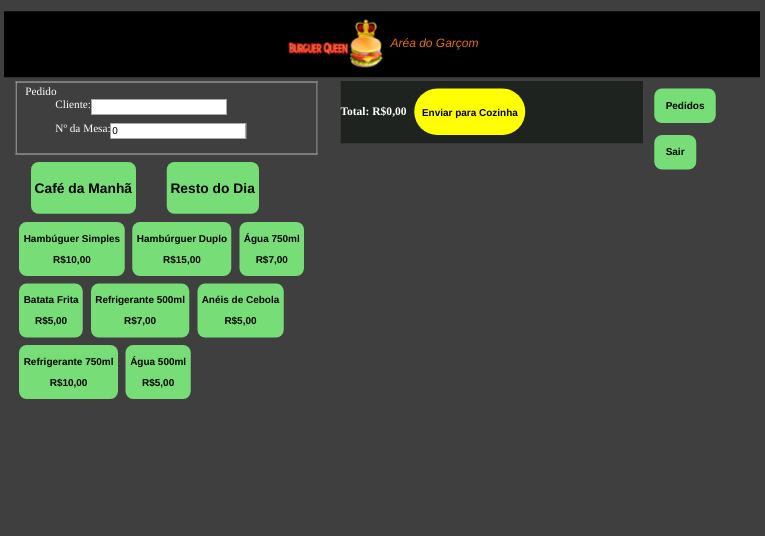

# Burger Queen

## Índice

* [1. O que é?](#1-o-que-é?)
* [2. Resumo do projeto](#2-resumo-do-projeto)
* [3. Como Utilizar](#3-como-utilizar)
* [4. Tecnologias Utilizadas](#4-tecnologias-utilizadas)
* [5. Objetivos de aprendizagem e Considerações Gerais](#5-objetivos-de-aprendizagem-e-considerações-Gerais)
* [6. Critérios atendidos](#6-critérios-atendidos)
* [7. Imagem da Interface](#7-imagem-da-interface)
* [8. Link](#8-link)

***
## 1. O que é?

Burguer Queen é um interface adaptada para tablet, no qual o garçom consegue fazer o pedido e mandar para o cozinheiro de forma fácil e prática.

## 2. Resumo do projeto

Programa possui 3 caminhos para usuário utilizar:

Na 1ª interface o Garçom terá dois menus, um para o café da manhã e outro para o resto do dia, ambos podem ser utilizado durante o dia todo, ao clicar no produto, ele será direcionado para a ordem ao lado com o resumo da compra.

Na 2ª interface o Garçom consegue ver os pedidos prontos para entrega, no qual pode marcar como "Entregue" e ver o Histórico do pedidos.

Na 3ª interface é direcionada ao Cozinheiro, no qual consegue ver o resumo do pedido, poderá marcar como "Pronto" e o Histórico de pedidos também.

## 3. Como Utilizar

O funcionario deve se cadastrar, se atentar na escolha do Cargo, pois o mesmo só verá o que faz parte do seu departamento.

O Garçom pode escolher os produtos dos menus, verificar o carrinho, o total da nota, além de marcar o pedido como entregue e ver o histórico das ordens.

O Cozinheiro consegue ver as ordens com o resumo do produtos, marcar como pronto e ver o Histórico dos pedidos também.
 
## 4. Tecnologias Utilizadas

* HTML5
* JavasScript (ES6)
* Aphrodite (CSS)
* React Hooks
* growl-alert

## 5. Objetivos de aprendizagem e Considerações Gerais

O objetivo principal envolveu o aprendizado da construção de uma interface web usando React. A interface também foi planejada especificamente para rodar em tablets. O aplicativo é um Single Page App.

O aplicativo utilizou scripts npm-scripts e teve start, build e deploy, que são responsáveis por iniciar, empacotar e implantar o aplicativo, respectivamente.

## 6. Critérios atendidos

[História de usuário 1] Garçom/Garçonete deve poder anotar o seu pedido
Eu como garçom/garçonete quero poder anotar o meu pedido saber o valor de cada produto e poder enviar o pedido para a cozinha para ser preparado.

Critérios de aceitação
O que deve acontecer para satisfazer as necessidades do usuário?

Anotar o nome e mesa.
Adicionar produtos aos pedidos.
Excluir produtos.
Ver resumo e o total da compra.
Enviar o pedido para a cozinha (guardar em algum banco de dados).
Funcionar bem e se adequar a um tablet.

[História de usuário 2] Chefe de cozinha deve ver os pedidos
Eu como chefe de cozinha quero ver os pedidos dos clientes em ordem, poder marcar que estão prontos e poder notificar os garçons/garçonetes que o pedido está pronto para ser entregue ao cliente.

Critérios de aceitação
Ver os pedidos à medida em que são feitos.
Marcar os pedidos que foram preparados e estão prontos para serem servidos.
Ver o tempo que levou para preparar o pedido desde que chegou, até ser marcado como concluído.

[História de usuário 3] Garçom/Garçonete deve ver os pedidos prontos para servir
Eu como garçom/garçonete quero ver os pedidos que estão prontos para entregá-los rapidamente aos clientes.

Critérios de aceitação
Ver a lista de pedidos prontos para servir.
Marque os pedidos que foram entregues.
Os dados devem ser mantidos intactos, mesmo depois que um pedido terminado. Tudo isso para poder ter estatísticas no futuro.

[História de usuário 4] Usuário deve ter seu perfil (login/senha) para acessar o sistema.
Eu como funcionário do restaurante quero entrar na plataforma e ver apenas a tela importante para o meu trabalho.

Critérios de aceitação
O que deve acontecer para satisfazer as necessidades do usuário?

Criar login e senha.
Criar tipo de usuário (cozinha / salão).
Entrar na tela correta para cada usuário.

## 7. Imagem da Interface

## 8. Link

